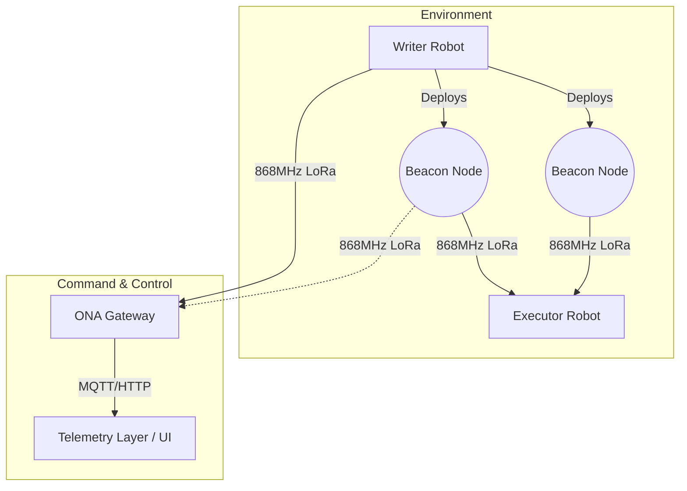

# Project Nabad (نبض)

Project Nabad is an autonomous multi-node Urban Search and Rescue (USAR) robotic architecture. It utilizes Raspberry Pi, ESP32, LoRa communication, ROS2/SLAM, computer vision, and environmental sensing to navigate and map hazardous environments without relying on conventional infrastructure.

## 1. Problem

In post-disaster scenarios like earthquakes or collapsed infrastructure, conventional communication networks (cellular, Wi-Fi) and GPS signals often fail or are severely degraded. Emergency responders need a reliable way to map hazards and locate victims in these GPS-denied and communication-restricted environments before it is safe for human teams to enter.

## 2. Our Solution

We developed a dual-robot deployment strategy paired with a resilient LoRa mesh network. A perception node (Writer Robot) explores the environment, performs SLAM, detects victims using computer vision, and deploys standalone Beacon Nodes at key locations. An Executor Robot then navigates using the deployed beacons and LoRa RSSI to deliver medical aid. The ONA Gateway intercepts telemetry and translates local coordinates to global coordinates for remote monitoring.

## 3. System Architecture



## 4. Hardware

| Node | Hardware | Role |
|------|----------|------|
| Writer Robot | Raspberry Pi 4, ESP32-WROOM, RPLiDAR A1, Pi Camera, MLX90640, MQ-2/MQ-7, SX1276 LoRa | Exploration, SLAM mapping, victim detection, sensor fusion, beacon deployment |
| ONA Gateway | Raspberry Pi 4B, ESP32, SX1276 LoRa, u-blox NEO-M9N GNSS | LoRa reception, hardware firewall, local ENU to global WGS84 translation, telemetry forwarding |
| Executor Robot | Monolithic ESP32, RPLiDAR A1, SX1276 LoRa, Servos, PAM8403, Water Pump | Navigates to target using LoRa RSSI and obstacle avoidance, delivers aid and instructions |
| Beacon Node | ESP32, SX1276 LoRa, NeoPixel, Magnetic reed switch | Transmits telemetry via ALOHA randomization, acts as RF breadcrumb |

## 5. Software Architecture

- **ROS2 & SLAM:** The Writer Robot runs ROS 2 Humble and BreezySLAM on the Raspberry Pi 4 for environment mapping and odometry.
- **Computer Vision:** YOLOv8n (INT8 quantized) runs on the Pi 4 for victim detection.
- **ESP32 Control:** ESP32 microcontrollers operate in bare-metal/RTOS to manage sensors (thermal, gas), actuators (servos, pumps), and LoRa transceivers.
- **Gateway Firewall:** The ONA Gateway ESP32 acts as a hardware firewall, parsing LoRa packets and dropping malformed payloads before they reach the Pi.
- **Communication Protocol:** A strict 20-byte C-struct over 868MHz LoRa connects all nodes.

## 6. AI / Computer Vision

- **Model:** YOLOv8n (INT8 quantized)
- **Target Classes:** Person
- **Training Dataset:** 5438 images (Roboflow COCO person subset)
- **Training Pipeline:** Configured in `ai_training_scripts/`
- **Inference Environment:** Raspberry Pi 4
- **Performance Metrics:** (Tested on validation set, epoch 236)
  - mAP50: 0.7216
  - Precision: 0.84
  - Recall: 0.62
  - F1 Score: 0.71 at confidence 0.340
  - True Positive rate (Person): 93%

## 7. Communication Protocol

All nodes communicate via 868MHz LoRa using a strict 20-byte Little-Endian C-struct (`BeaconPacket`). 

- **Packet Size:** 20 bytes (`<HBBhhbIHBH` format)
- **Fields:** Header, Type, Flags, X, Y, Z, Confidence, Timestamp, CRC-16
- **Byte Order:** Little-Endian
- **Checksum:** CRC-16 CCITT-FALSE (`0x11021` polynomial, `0xFFFF` initialization)
- **Transmission Behavior (Beacons):** Uses ALOHA-based temporal randomization (transmits every 3 seconds ± 500ms jitter) to minimize collisions.

## 8. Coordinate System

The robots operate in a local East-North-Up (ENU) coordinate frame based on their SLAM origin. The ONA Gateway intercepts these local coordinates and uses a u-blox NEO-M9N GNSS anchor to establish a reference point. The `translator.py` module applies tangent-plane mathematics to accurately translate the local ENU coordinates into global WGS84 latitude/longitude for external telemetry.

## 9. Repository Structure

```text
.
├── ai_training_scripts/   # YOLOv8 training and validation scripts
├── Beacon_node/           # ESP32 firmware for deployable beacons
├── datasets/              # Dataset preparation scripts
├── docs/                  # Technical documentation
├── Executor_Robot/        # ESP32 firmware for the medical delivery robot
├── ONA_Gateway/           # Pi/ESP32 code for LoRa-to-IP translation
├── report/                # Technical report (LaTeX)
├── Shared_Protocols/      # Common Python/C++ definitions for LoRa packets
├── tests/                 # Unit tests for protocol and translation logic
├── Writer_Robot/          # ROS2 workspace, AI inference, and ESP32 control
└── README.md
```

## 10. Installation

### Raspberry Pi Environment (Writer Robot)
```bash
cd Writer_Robot/ros2_ws
chmod +x install_ros2_pi.sh
./install_ros2_pi.sh
pip install -r ../requirements.txt
```

### AI Environment
```bash
pip install ultralytics opencv-python numpy
```

### ESP32 Firmware
Use the Arduino IDE or PlatformIO to flash the respective `.ino` files located in:
- `Writer_Robot/esp32_src/writer_esp32/writer_esp32.ino` (if applicable)
- `Executor_Robot/executor_core.ino`
- `Beacon_node/beacon_core.ino`
- `ONA_Gateway/esp32_src/ona_esp32.ino` (if applicable)

## 11. Running the System

**1. ONA Gateway:**
```bash
cd ONA_Gateway/pi_src
python3 ona_gateway.py
```

**2. Writer Robot:**
```bash
cd Writer_Robot/pi_src
python3 writer_node.py
```
*(ROS2 nodes are launched via the respective launch files in the workspace).*

## 12. Validation and Testing

| Test | Purpose | Expected Result | Actual Result | Status |
|------|---------|-----------------|---------------|--------|
| CRC-16 Parity (`test_beacon_schema.py`) | Verify Python struct packing and CRC calculation matches ESP32 C++ implementation. | Python output identically matches C++ struct bytes. | ✅ Matches C++ firmware | Tested |
| Coordinate Translation (`test_translator.py`) | Verify ENU to WGS84 tangent-plane math accuracy. | Local (0,0) equals GNSS anchor; offsets match expected Haversine distances. | ✅ Math verified | Tested |
| Field Hardware Testing | End-to-end LoRa range, mesh stability, and physical beacon deployment. | Stable connection at intended ranges; beacons deploy reliably. | Not yet documented. | Planned |

## 13. Implemented vs Planned

| Feature | Status |
|---------|--------|
| LoRa Communication Protocol (20-byte struct, CRC-16) | ✅ Implemented |
| YOLOv8 INT8 Vision Pipeline | ✅ Implemented |
| ENU to WGS84 Coordinate Translation | ✅ Implemented |
| Beacon ALOHA Transmission | ✅ Implemented |
| ROS2 / SLAM Integration | 🟡 Prototype |
| Executor RSSI Homing | 🟡 Prototype |
| Field-Tested Hardware Deployment | 🔴 Planned |
| Fully Autonomous Navigation | 🔴 Planned |

## 14. Evidence

- **AI Metrics:** `runs/detect/writer_robot_vision_v3-4/results.csv`, `BoxF1_curve.png`, `confusion_matrix_normalized.png` (Available in repository)
- **Protocol Tests:** `tests/test_beacon_schema.py`, `tests/test_translator.py`
- **Hardware photos:** *Evidence to be added.*
- **Demo video:** *Evidence to be added.*

## 15. Design Decisions

| Decision | Reason |
|----------|--------|
| ESP32 | Low-cost, robust for real-time bare-metal sensor/actuator control, built-in I2C/SPI support for LoRa and sensors. |
| Raspberry Pi 4 | Necessary compute power for running ROS2, SLAM, and YOLOv8 inference simultaneously. |
| LoRa (868MHz) | High penetration through obstacles (rubble) and long range, essential for communication-denied environments. |
| ROS2 | Industry standard for robotics mapping and navigation; modular node architecture. |
| YOLOv8n | Balances high detection accuracy with lightweight inference capable of running on a Pi 4 without specialized TPUs. |

## 16. Limitations

- **Hardware Validation:** The system has not been fully validated on physical hardware in realistic disaster environments.
- **Dataset Bias:** The model is trained on the Roboflow COCO person subset, which may not accurately represent victims partially obscured by rubble or dust.
- **Autonomy:** Full autonomous path planning and exploration logic is still under development.
- **Bandwidth:** LoRa bandwidth severely limits the telemetry update rate, requiring strict 20-byte packet limitations.

## 17. Future Work

- Expanding the AI dataset to include thermal and simulated disaster imagery.
- Moving from YOLOv8n to a hardware-accelerated model using an Edge TPU (e.g., Coral).
- Implementing complete physical validation tests for the Executor Robot's RSSI homing.
- Optimizing SLAM parameters for highly unstructured environments.

## 18. Technical Report

The detailed technical report and theoretical backing can be found in `report/report.tex`.