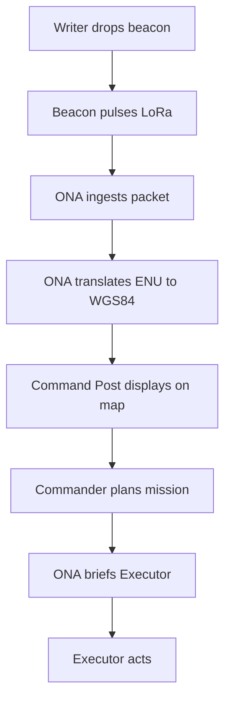
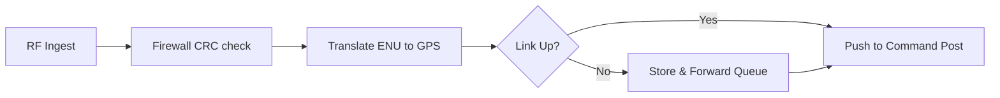

# System Architecture

## Overview
Project Nabad uses a decentralized architecture composed of four distinct nodes designed to operate in GPS-denied and communication-restricted environments.

## Node Roles

1. **Writer Robot**: An autonomous explorer equipped with a Raspberry Pi 4 (for ROS2, SLAM, and YOLOv8 inference) and an ESP32 for hardware management (thermal, gas sensors, servos). It maps the environment and drops Beacon Nodes when it detects victims or hazards.
2. **Beacon Nodes**: ESP32-based devices deployed by the Writer Robot. They act as RF breadcrumbs, transmitting localized coordinates and event data via LoRa.
3. **Executor Robot**: An ESP32-based autonomous vehicle that navigates using RPLiDAR and LoRa RSSI to follow the breadcrumb trail and deliver medical payloads.
4. **ONA Gateway**: The central telemetry hub. An ESP32 handles LoRa reception as a hardware firewall, forwarding validated packets to a Raspberry Pi 4, which translates local coordinates to global WGS84 coordinates and pushes them to the command post.

## Data Flow

## ONA Processing Pipeline

