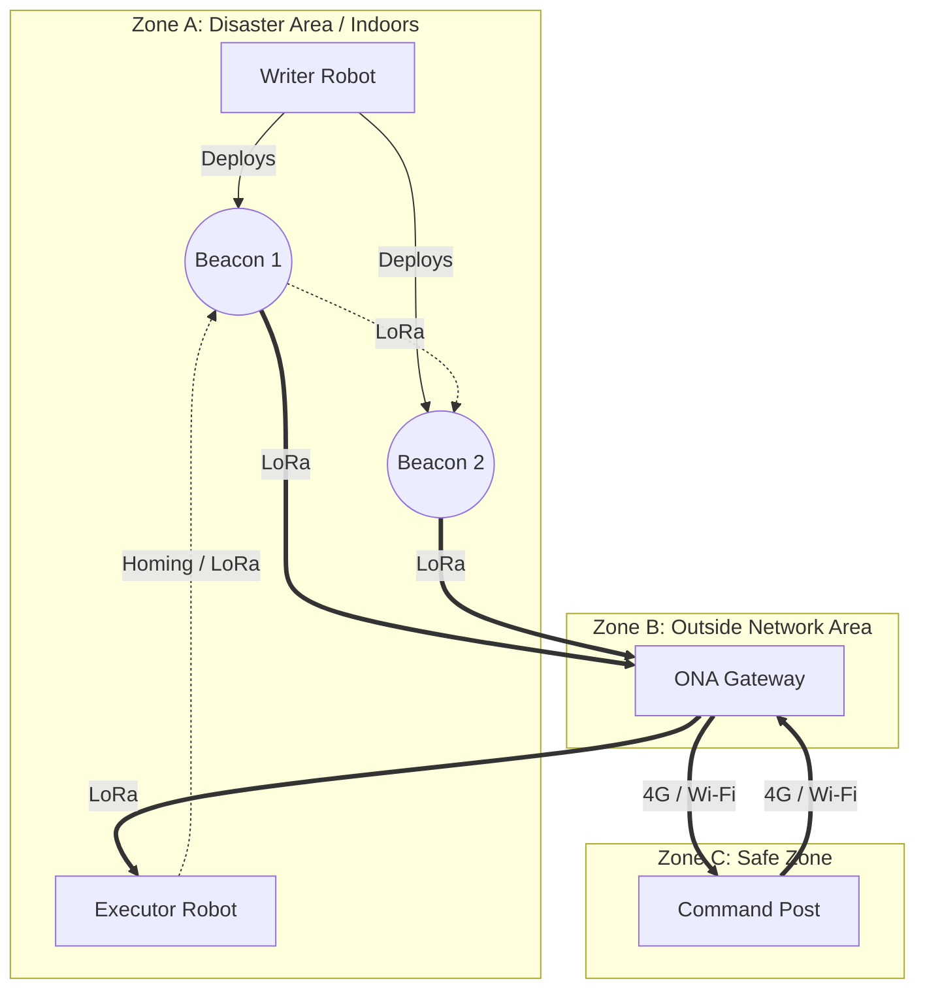
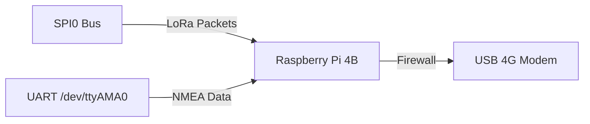
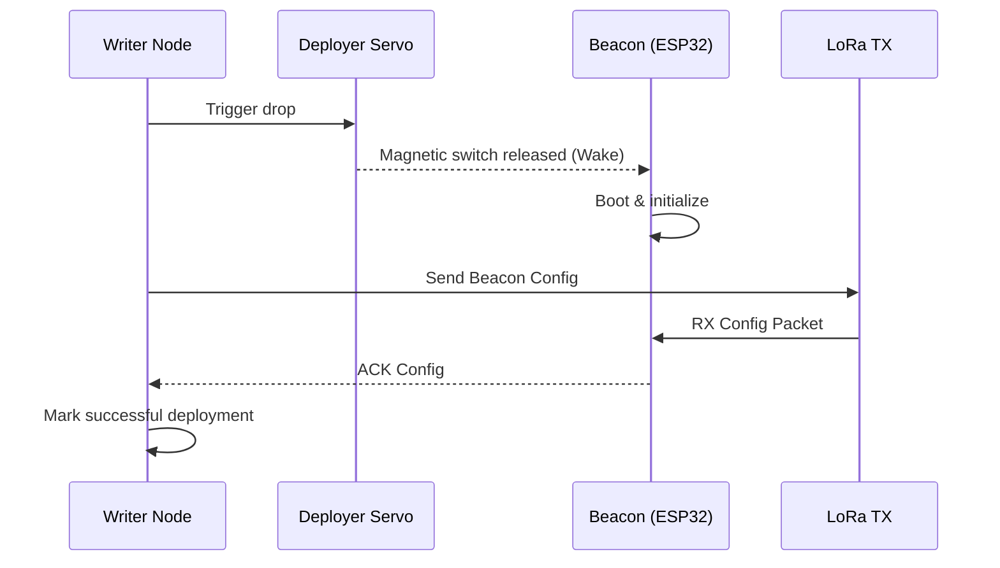
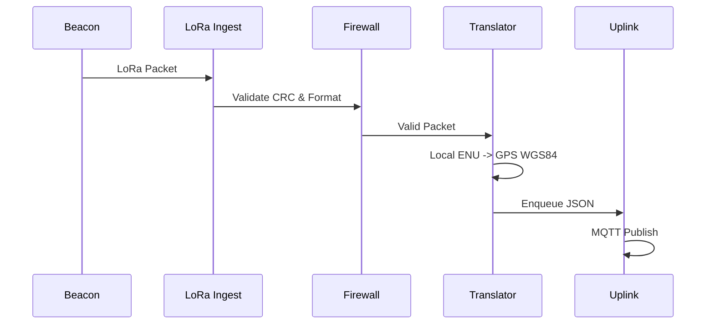
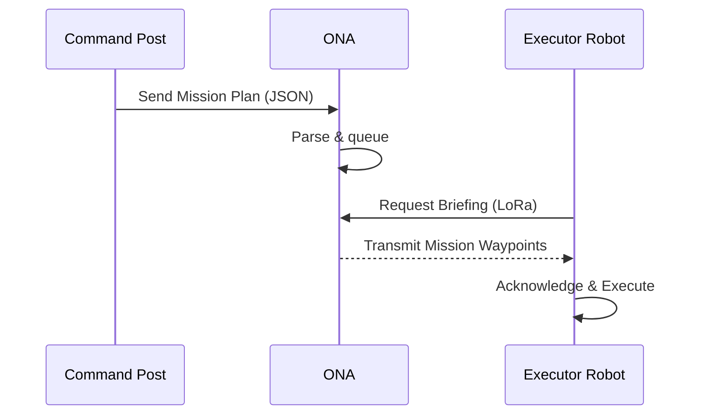
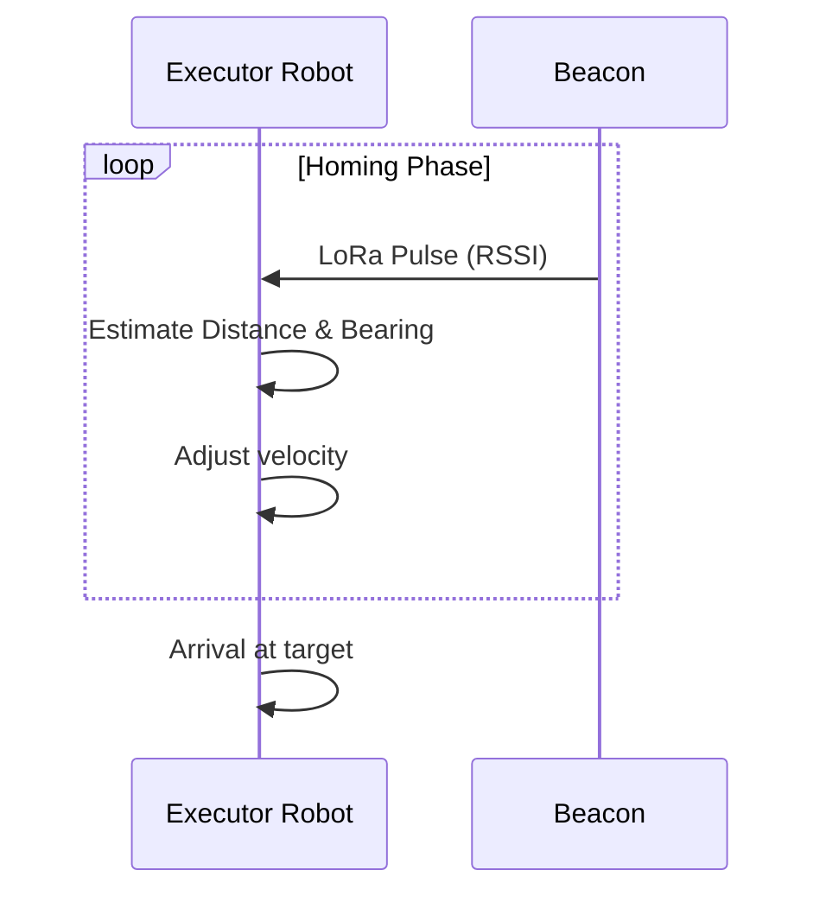

# System Architecture

The Living Map USAR (Urban Search and Rescue) system is divided into three distinct zones to ensure reliable operation in disconnected and hazardous environments.

## Zone Architecture

## Data Flow: LoRa → ONA → 4G/Wi-Fi → Command Post
1. **Writer Robot** drops beacons at points of interest (hazards, victims).
2. **Beacons** pulse out their 20-byte data packets via LoRa (868 MHz).
3. **ONA Gateway** ingests LoRa packets, translates local coordinates to global GPS coordinates, and pushes the data to the Command Post via 4G or Wi-Fi.
4. **Command Post** receives telemetry and map data, allowing commanders to plan missions.
5. **ONA Gateway** relays mission briefings back to the **Executor Robot** via LoRa before it enters the hazardous zone.

## ONA Bus Isolation Diagram

## Software Architecture
- **Writer Pi**: `writer_node.py` (exploration, event detection, beacon deployment)
- **Executor Pi**: `executor_node.py` (mission planning, homing, verification)
- **ONA Pi**: `ona_gateway.py` (LoRa ingest, translation, uplink, firewall)
- **Beacon ESP32**: MicroPython `main.py` (deep sleep, lock-in, periodic pulse)

## Sequence Diagrams

### a) Writer Beacon Deployment Handshake

### b) ONA Packet Processing Pipeline

### c) Executor Mission Briefing

### d) Executor Beacon Homing

