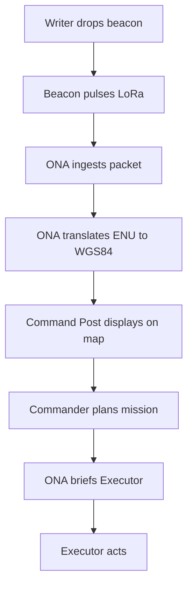
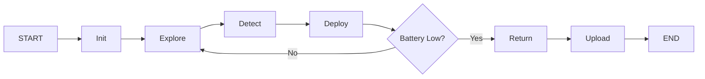
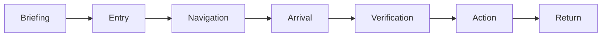
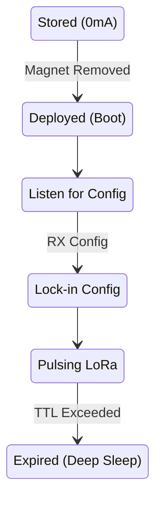

# System Data Flow



## Writer Mission Flow


## Executor Mission Flow


## Beacon Lifecycle


## ONA Processing Pipeline
```mermaid
flowchart LR
    RF_Ingest[RF Ingest] --> Firewall[Firewall (CRC check)]
    Firewall --> Translate[Translate (ENU to GPS)]
    Translate --> Uplink{Link Up?}
    Uplink -->|Yes| Push[Push to Command Post]
    Uplink -->|No| Store[Store & Forward Queue]
    Store --> Push
```
